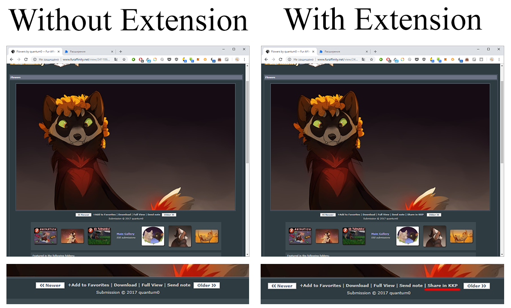
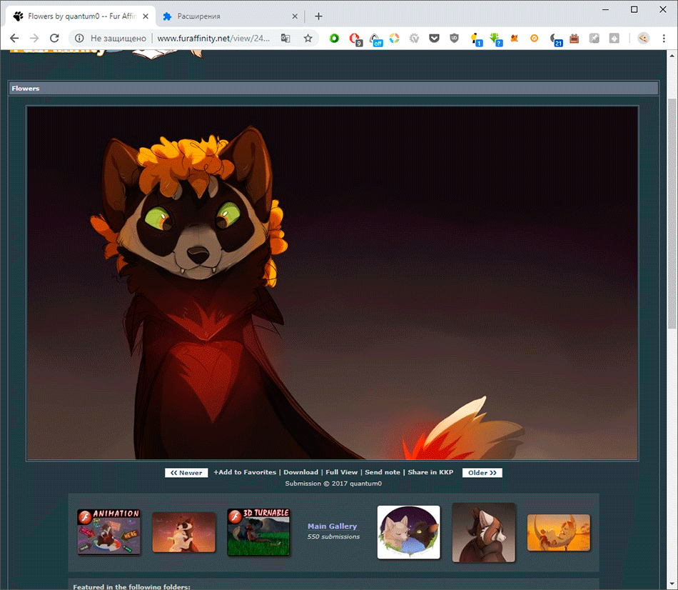

# FA Share Button Chrome Extension
Моё первое расширение для браузера Google Chrome.

Данное расширение добавляет кнопку "Поделиться" на сайте Furaffinity.net.

## Демонстрация работы

## Проблема с кросс-доменным запросом
По нажатию данной кнопки происходит cross-domain POST запрос к серверу, который в свою очередь выполняет обращение к VK API, отправляя ссылку со страницы, где была нажата кнопка в общий чат, подписывая кто поделился, чем и кто автор. Вызов происходит через сторонний сервер в связи с тем, что VK отклоняет кросс-доменные запросы.

## Описание
Расширение имеет минимальный функционал и написано "крайне неуниверсально" и очень криво для узкой группы лиц и было создано скорее для ознакомления с процессом создания расширений для браузера Chrome, нежели для какой-то практической пользы. Тем не менее, расширение позволяет сократить действие в несколько кликов и/или нажатий клавиш (F6, Ctrl+C, Ctrl+Tab несколько раз, Ctrl+V, Enter, Ctrl+Shift+Tab несколько раз) до одного клика.

В дальнейшем, возможно, данное расширение для браузера будет улучшено и сделано более универсальным. Но это не точно ;)
